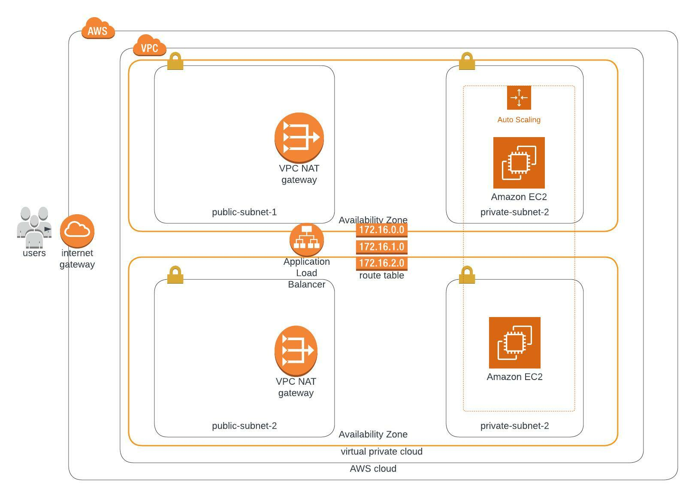

### Project Title - Deploy a high-availability web app using CloudFormation
This folder provides the starter code for the "ND9991 - C2- Infrastructure as Code - Deploy a high-availability web app using CloudFormation" project. This folder contains the following files:

#### network.yml
CloudFormation code using this YAML template for building the cloud network infrastructure

####network-parameters.json
contains required parameters for network stack.

#### servers.yml
CloudFormation code using this YAML template for building the cloud servers and security groups required services.

#### server-parameters.json
contains required parameters for servers stack.

#### Load Balancer DNS is :
 <strong>http://serve-WebAp-Q19C7VAJ7ILT-1104329857.us-east-1.elb.amazonaws.com</strong>

#### Diagram
